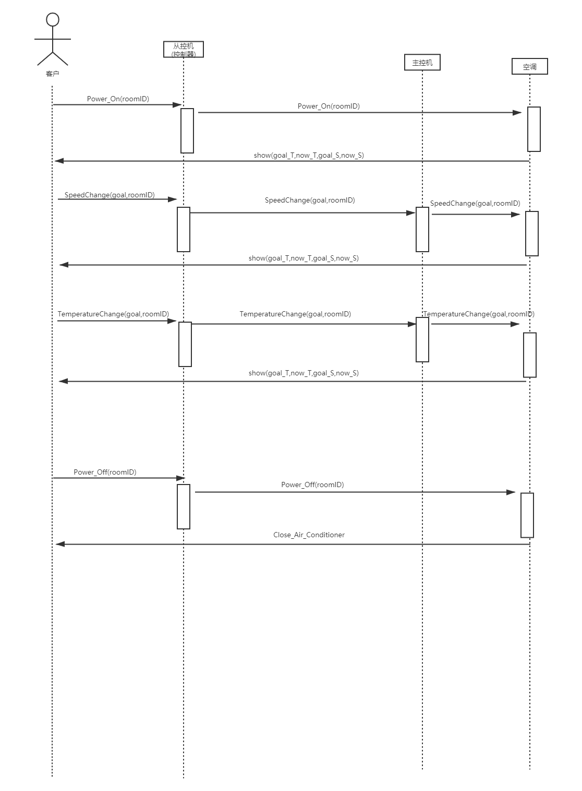

# 住户动态结构设计

## 住户用例（使用空调）系统顺序图

## 操作契约

| 系统事件 |  Power_On(roomID)   |
| -------- | --- |
| 交叉引用 | 使用空调  |
| 前置条件 | 主控机对象master已经创建，并且master维护了一个map对象slave_list（从控机信息表），在用户在前台办理入住时，就在slave_list中以roomID为键，创建了一个slave对象（从控机），并将slave的属性目标温度、风速设置为初始化值，计算并显示当前温度    |
| 后置条件 | 从控机开启    |

| 系统事件 | TemperatureChange(goal,roomID)  |
| -------- | --- |
| 交叉引用 | 使用空调  |
| 前置条件 | 从控机开启    |
| 后置条件 | 在slave_list中将对应房间的slave对象目标温度属性设置为goal    |

| 系统事件 | SpeedChange(goal,roomID)  |
| -------- | --- |
| 交叉引用 | 使用空调  |
| 前置条件 | 从控机开启    |
| 后置条件 | 在slave_list中将对应房间的slave对象风速属性设置为goal     |

| 系统事件 | show(goal_T,now_T,goal_S,now_S)  |
| -------- | --- |
| 交叉引用 | 使用空调  |
| 前置条件 | 从控机开启    |
| 后置条件 | 显示当前房间slave对象的目标温度和风速，计算并显示当前温度，并且将当前温度值赋值给slave对象中的当前温度属性   |

| 系统事件 | Power_Off(roomID)    |
| -------- | --- |
| 交叉引用 | 使用空调  |
| 前置条件 | 用户按下关机按钮    |
| 后置条件 |当前房间对应的slave对象中的当前温度、目标温度和风速设置为null   |

| 系统事件 | Close_Air_Conditioner    |
| -------- | --- |
| 交叉引用 | 使用空调  |
| 前置条件 | 空调已经关闭    |
| 后置条件 | 不再显示当前温度、风速和目标温度  |

