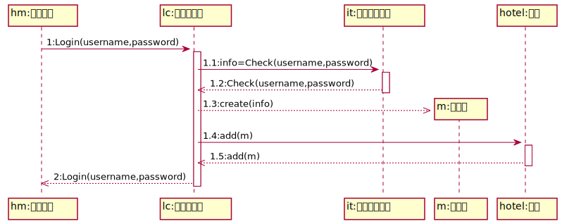
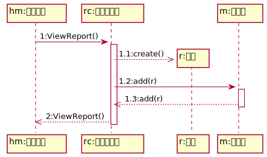
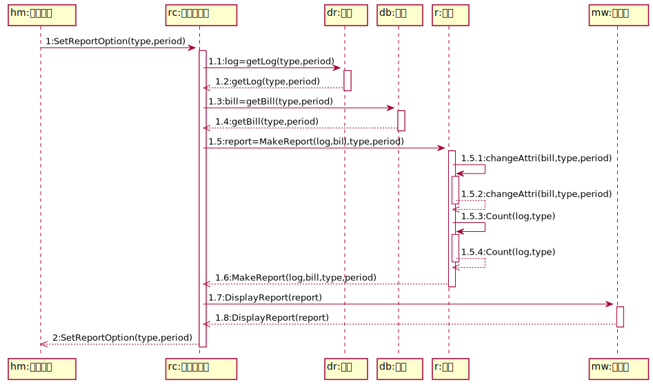
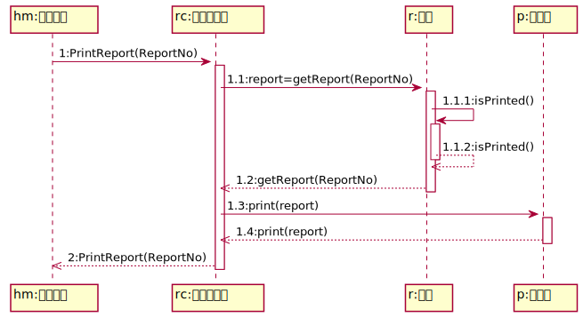
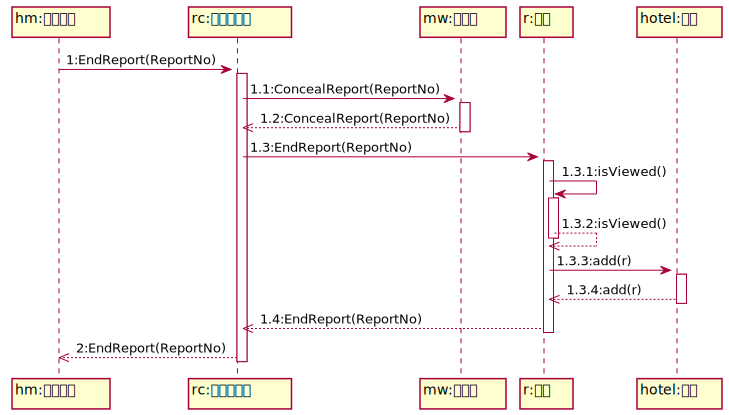

# 酒店经理动态结构设计

## 登录系统用例

### 控制器选择

由于系统用例较多，因此选择使用“用例控制器”，以登录控制器作为登录系统用例中的控制器。

### 系统操作

| 操作名称 | 操作说明 |
| -------- | -------- |
| Login(username,password) | 登录系统 |

### 具体设计

#### 操作契约

| 系统事件 | Login(username,password) |
| -------- | --- |
| 交叉引用 | 登录系统 |
| 前置条件 | 服务端处于开启且可用状态，且系统已打开 |
| 后置条件 | 1. 一个管理员实例被创建 |
|          | 2. 管理员的属性初始化 |
|          | 3. 管理员实例与酒店建立"关联" |

#### 交互图

| 操作名称 | 功能|
| -------- | --- |
| Login(username,password) | 输入用户名和密码，登录系统 |
| Check(username,password) | 查询管理员信息表，确认用户名和密码是否正确，并返回此管理员的信息info |
| create(info) | 用管理员的信息info创建此管理员的实例，并初始化此管理员实例 |
| add(m) | 将此管理员实例和酒店建立"关联" |

## 统计报表管理用例

### 控制器选择

由于系统用例较多，因此选择使用“用例控制器”，以报表控制器作为统计报表管理用例中的控制器。

### 系统操作

| 操作名称 | 操作说明 |
| -------- | -------- |
| ViewReport() | 进入查看报表页面 |
| SetReportOption(type,period) | 设置报表参数 |
| PrintReport(ReportNo) | 打印报表 |
| EndReport(ReportNo) | 关闭报表 |

#### 操作契约

| 系统事件 | ViewReport() |
| -------- | --- |
| 交叉引用 | 查看报表 |
| 前置条件 | 酒店经理身份验证通过，开始查看报表 |
| 后置条件 | 1. 一个报表实例建立 |
|          | 2. 报表实例与管理员实例建立“关联” |
|          | 3. 报表的属性初始化：报表号、建立时间、存储信息的数组等 |

#### 交互图

| 操作名称 | 功能|
| -------- | --- |
| ViewReport() | 进入查看报表页面 |
| create() | 创建报表实例并初始化 |
| add(r) | 将报表实例与管理员实例建立“关联” |

#### 操作契约

| 系统事件 | SetReportOption(type,period) |
| -------- | --- |
| 交叉引用 | 查看报表 |
| 前置条件 | 酒店经理正在设置报表选项 |
| 后置条件 | 报表的属性被修改：report,type,period |

#### 交互图

| 操作名称 | 功能|
| -------- | --- |
| SetReportOption(type,period) | 设置报表参数 |
| getLog(type,period) | 从日志中得到period时间段内的所有房间使用空调的记录log并返回 |
| getBill(type,period) | 从详单中得到period时间段内的所有房间的详单记录数和总费用bill并返回 |
| MakeReport(log,bill,type,period) | 根据设置参数type，period和从日志和详单中得到的数据log和bill生成报表，并返回生成的报表report |
| changeAttri(bill,type,period) | 修改报表的属性type和period，同时将bill中的所有房间的详单记录数和总费用写入report中 |
| Count(log,type) | 根据所选报表种类，统计日志中得到的log数据，得到报表。如当type为日报表时，则统计所有房间使用空调的次数，最常用目标温度，最常用风速，达到目标温度次数和被调度次数写入report中。
| DisplayReport(report) | 打开报表显示页面，将report显示到屏幕上 |

#### 操作契约

| 系统事件 | PrintReport(ReportNo) |
| -------- | --- |
| 交叉引用 | 查看报表 |
| 前置条件 | 酒店经理正在查看报表，并选择打印报表 |
| 后置条件 | 报表属性被修改：isPrinted |

#### 交互图

| 操作名称 | 功能|
| -------- | --- |
| PrintReport(ReportNo) | 打印报表号为ReportNo的报表 |
| getReport(ReportNo) | 获得报表号为ReportNo的报表的信息并返回 |
| isPrinted() | 将isPrinted属性修改为1 |
| print(ReportNo) | 向打印机发起打印报表report的请求 |

#### 操作契约

| 系统事件 | EndReport(ReportNo) |
| -------- | --- |
| 交叉引用 | 查看报表 |
| 前置条件 | 酒店经理完成查看报表，并选择关闭报表 |
| 后置条件 | 1. 报表实例与酒店建立“关联” |
|          | 2. 报表属性被修改：isViewed |

#### 交互图

| 操作名称 | 功能|
| -------- | --- |
| EndReport(ReportNo) | 关闭报表 |
| ConcealReport(ReportNo) | 关闭报表页面 |
| isViewed() | 将isViewed属性修改为1 |
| add(r) | 将报表实例与酒店建立“关联” |

