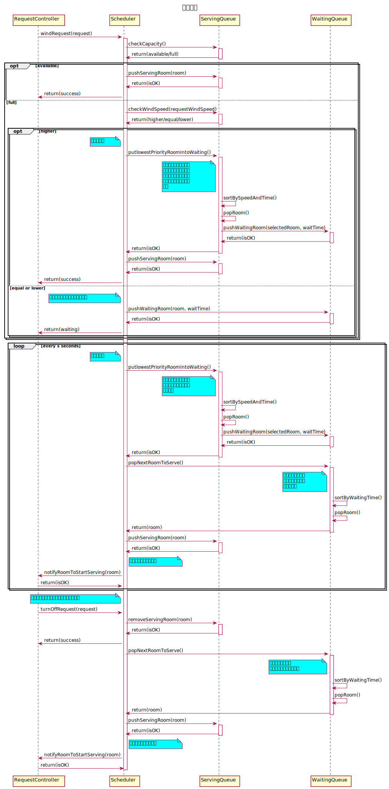

# 服务器调度交互过程设计

使用控制器模式，系统维护两个队列，分别为服务队列与等待队列。

## 具体调度过程

1. 控制器接收到客户端调风请求。检查服务队列 ServingQueue 是否有空位，如果 availible 则将服务对象推入服务队列，并返回 success；
2. 否则，进入**调度模式**。检查请求风速与服务队列中服务对象风速间的关系，
   1. 若高（higher），则进入**优先级调度**模式。正在服务的服务对象中选风速最低的放入等待队列；如果有多个风速相等，则找已服务时间最长的；
   2. 若相等或低（equal or lower），则放入**等待队列**，进入**时间片调度**模式。
3. **时间片调度**被实现为服务端的一个定时任务。调度器每隔一定的时间（s 秒）检查一遍队列，把服务队列中优先级最低的服务对象推入等待队列，并从等待队列中选取等待服务时间归零的房间推入服务队列，并主动通知从控机开机。
4. 在系统运行的过程中，如果有正在服务的从控机主动关机，则立即从等待队列中选取一个剩余时间最短的等待对象，并推入服务队列。

## 系统顺序图



```txt
@startuml

title 调度策略

RequestController -> Scheduler: windRequest(request)

activate Scheduler

Scheduler -> ServingQueue: checkCapacity()

activate ServingQueue
ServingQueue -> Scheduler: return(available/full)
deactivate ServingQueue

opt available
    Scheduler -> ServingQueue: pushServingRoom(room)
    activate ServingQueue
    ServingQueue -> Scheduler: return(isOK)
    deactivate ServingQueue
    Scheduler -> RequestController: return(success)
else full
    Scheduler -> ServingQueue: checkWindSpeed(requestWindSpeed)
    activate ServingQueue
    ServingQueue -> Scheduler: return(higher/equal/lower)
    deactivate ServingQueue
    opt higher
        note left of Scheduler #aqua
            优先级调度
        end note
        Scheduler -> ServingQueue: putlowestPriorityRoomIntoWaiting()
        activate ServingQueue
        note left of ServingQueue #aqua
        正在服务的服务对象中
        选风速最低的放入等待
        队列；如果有多个风速
        相等，则找服务时间最
        长的
        end note
        ServingQueue -> ServingQueue: sortBySpeedAndTime()
        ServingQueue -> ServingQueue: popRoom()
        ServingQueue -> WaitingQueue: pushWaitingRoom(selectedRoom, waitTime)
        activate WaitingQueue
        WaitingQueue -> ServingQueue: return(isOK)
        deactivate WaitingQueue
        ServingQueue -> Scheduler: return(isOK)
        deactivate ServingQueue
        Scheduler -> ServingQueue: pushServingRoom(room)
        activate ServingQueue
        ServingQueue -> Scheduler: return(isOK)
        deactivate ServingQueue
        Scheduler -> RequestController: return(success)
    else equal or lower
        note left of Scheduler #aqua
            放入等待队列，等待时间片调度
        end note
        Scheduler -> WaitingQueue: pushWaitingRoom(room, waitTime)
        activate WaitingQueue
        WaitingQueue -> Scheduler: return(isOK)
        deactivate WaitingQueue
        Scheduler -> RequestController: return(waiting)
    end
end


loop every s seconds
    note left of Scheduler #aqua
        时间片调度
    end note

    Scheduler -> ServingQueue: putlowestPriorityRoomIntoWaiting()
    activate ServingQueue
        note left of ServingQueue #aqua
        正在服务的服务对象中
        选服务时间最长的放入
        等待队列
        end note
    ServingQueue -> ServingQueue: sortBySpeedAndTime()
    ServingQueue -> ServingQueue: popRoom()
    ServingQueue -> WaitingQueue: pushWaitingRoom(selectedRoom, waitTime)
    activate WaitingQueue
    WaitingQueue -> ServingQueue: return(isOK)
    deactivate WaitingQueue
    ServingQueue -> Scheduler: return(isOK)
    deactivate ServingQueue
    Scheduler -> WaitingQueue: popNextRoomToServe()
    activate WaitingQueue
        note left of WaitingQueue #aqua
        从等待队列中选取
        等待服务时间超时
        的等待对象
        end note
    WaitingQueue -> WaitingQueue: sortByWaitingTime()
    WaitingQueue -> WaitingQueue: popRoom()
    WaitingQueue -> Scheduler: return(room)
    deactivate WaitingQueue
    Scheduler -> ServingQueue: pushServingRoom(room)
    activate ServingQueue

    ServingQueue -> Scheduler: return(isOK)
    deactivate ServingQueue
        note right of Scheduler #aqua
        服务端主动通知从控机
        end note
    Scheduler -> RequestController: notifyRoomToStartServing(room)
    RequestController -> Scheduler: return(isOK)

end

note left of Scheduler #aqua
    有服务对象关机（主动或达到目标温度）
end note

RequestController -> Scheduler: turnOffRequest(request)
Scheduler -> ServingQueue: removeServingRoom(room)
activate ServingQueue
ServingQueue -> Scheduler: return(isOK)
deactivate ServingQueue
Scheduler -> RequestController: return(success)


Scheduler -> WaitingQueue: popNextRoomToServe()
    activate WaitingQueue
        note left of WaitingQueue #aqua
        从等待队列中选取
        剩余时间最短的等待对象
        end note
    WaitingQueue -> WaitingQueue: sortByWaitingTime()
    WaitingQueue -> WaitingQueue: popRoom()
    WaitingQueue -> Scheduler: return(room)
    deactivate WaitingQueue
    Scheduler -> ServingQueue: pushServingRoom(room)
    activate ServingQueue

    ServingQueue -> Scheduler: return(isOK)
    deactivate ServingQueue
        note right of Scheduler #aqua
        服务端主动通知从控机
        end note
    Scheduler -> RequestController: notifyRoomToStartServing(room)
    RequestController -> Scheduler: return(isOK)

deactivate Scheduler

@enduml
```
