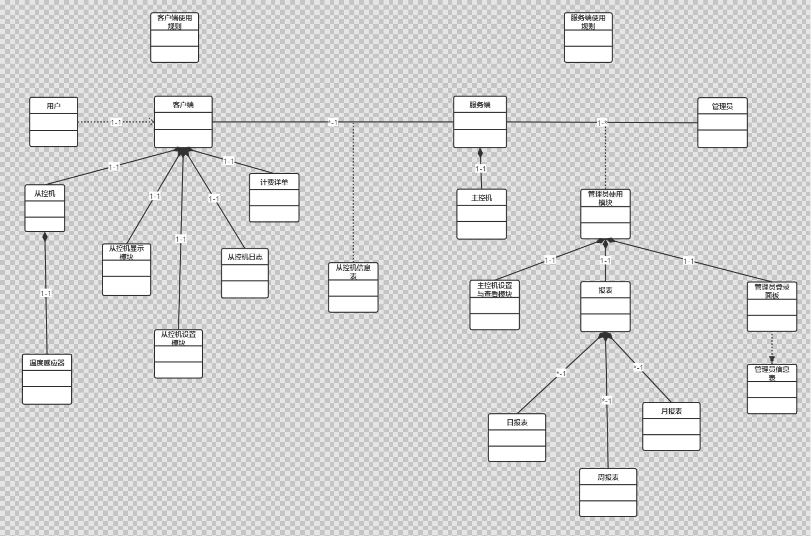

# 需求定义及领域模型

2017211317 班 C 组

## 修改历史

| 修改人 | 版本  | 修改时间   | 描述                       |
| ------ | ----- | ---------- | -------------------------- |
| 赵子豪 | 0.4.0 | 2020-03-25 | 增加领域模型类图 |
| 曾莉慧瑶 | 0.3.0 | 2020-03-25 | 增加管理员业务流程 |
| 汪桐 | 0.2.0 | 2020-03-24 | 增加整体业务介绍，主控机业务流程 |
| 邱建鑫 | 0.1.0 | 2020-03-22 | 创建文档，增加住户业务流程 |

## 业务介绍及业务流程

本文档定义以下实体：

- **管理员**：酒店工作人员，如前台、财务、空调管理人员等；
- **住户**：前来住宿的客户；
- **主控机**：中央空调，由**管理员**操控；
- **从控机**：房间空调，由**住户**操控；
- **服务端**：管理**主控机**的软件实体，并向**管理员**提供操作界面；
- **客户端**：管理**从控机**的软件实体，并向**住户**提供操作界面。

### 整体业务介绍

此分布式温控系统能够向**管理员**与**住户**提供相应的服务，使**客户**能够通过**客户端**按照需求调节**从控机**的温度和风速，并从**客户端**获取详细账单，缴纳费用；使**管理员**能够通过**服务端**按需求调节**主控机**运行模式，并通过**服务端**监控各**住户**房间内**从控机**的工作状态。**服务端**能向**管理员**提供日/周/月报表信息以及计费详单。

### 主控机业务流程

1. **管理员**可开启或关闭主控机；
2. **服务端**允许**管理员**登录或注册，获取权限；
3. 酒店信息由**管理员**通过**服务端**录入；
4. **住户**到店，办理入住手续，授予**住户**相应**从控机**的使用权限；
5. **住户**开启房间内的**从控机**，**主控机**开始计费；
6. **主控机**可实时监控各房间**从控机**运行状态；
7. **主控机**可采集各房间温度状态，以及**从控机**目标温度状态；
8. **主控机**可采集**从控机**风速设置状态；
9. **主控机**可接受各个**从控机**发出的温度设置请求、风速调节请求和关机请求，并按照要求调节；
10. 酒店一共有x间客房，**主控机**在同一时刻只能为y间（x>y）房提供送风服务；
11. 新的送风请求到来，如果当前**主控机**提供服务的客房数少于y，则立即响应；
12. 否则，若新送风请求的风速若高于（高风>中风>低风）正在接受服务的某个送风请求，则**主控机**将立即服务高风速请求；
13. 若等待服务的送风请求与正在接受服务的送风请求相比，它们所请求的风速相同，则新请求等待一段时间后（s秒）获得送风服务，获得服务时间最长的房间被暂停送风服务。
14. 即使没有收到**从控机**请求，**管理员**也可通过**服务端**控制各房间**从控机**的运行状态；
15. **主控机**将统计各房间所需支付金额；
16. **主控机**将监控各房间账户余额并发出缴费通知；
17. **主控机**可以生成日/周/月报表信息以及计费详单；
18. **管理员**可以通过**服务端**查看**住户**的总数、身份信息、对应房间和缴费情况；
19. **管理员**可以通过**服务端**查看日/周/月报表信息以及计费详单；
20. **住户**关闭房间内的**从控机**，**主控机**停止计费；
21. **住户**离店，办理退房手续，**主控机**回收**从控机**使用权限，并向**管理员**提供此住户的消费详单；
22. **管理员**关闭主控机，

### 管理员业务流程

1. **管理员**进入**服务端**注册，设置登录权限和密码；
2. **管理员**进入**服务端**登录，进行操作时的身份认定；
3. **管理员**通过**服务端**录入酒店信息；
4. **管理员**通过**服务端**为**住户**注册，授予住户**从控机**的使用权限；
5. **管理员**可通过**服务端**监控各房间**从控机**的工作状态；
6. **管理员**可以通过**服务端**查看**住户**的总数、身份信息、对应房间和缴费情况；
7. **管理员**可以通过**服务端**查看日/周/月报表信息以及计费详单；
8. **住户**离店，办理退房手续，**主控机**回收**从控机**使用权限，**管理员**获得此**住户**的消费详单；
9. **管理员**为**住户**开具对应**账单**与**详单**，注销用户信息并清空相应缴费信息；
10. **管理员**关闭主控机，

### 住户业务流程

1. **住户**到店，办理入住手续，获得**从控机**使用权限；
2. **住户**可开启或关闭**从控机**；
3. **从控机**具有两种模式：制冷模式与制热模式；
4. **住户**可以通过**客户端**的模式调节按钮，调节**从控机**模式；
5. 房间初始温度为 25 度，**从控机**关机状态下，每分钟变化 0.5 度，直到变化到初始温度为止；
6. **住户**可以通过**客户端**的温度调节按钮，来调节**从控机**温度目标；
7. 温度调节按钮连续两次或多次指令发送的时间间隔小于 1 秒时，**客户端**只发送最后一次的指令参数；
8. **从控机**在制冷模式下，温度目标范围为 18-25 度；
9. **从控机**在制热模式下，温度目标范围为 25-30 度；
10. **从控机**具有三种风速：高风、中风与低风；
11. **住户**可以通过**客户端**的风速调节按钮，来调节**从控机**风速；
12. 中风模式下房间温度每分钟变化 0.5 度，高风模式每分钟变化率提高 20%，低风模式每分钟变化率减小 20%；
13. **从控机**具有**温度传感器**，可实时检测房间温度；
14. 房间温度达到目标值以后，**客户端**自动发送停止送风请求给**服务端**。此后，当房间温度与目标温度相差超过 1 度时，**从控机**重新启动；
15. **从控机**运行期间，**客户端**实时显示当前消费金额；
16. 电费余额不足时，**从控机**自动停止运行；
17. **住户**可通过**客户端**来缴纳电费，缴纳后**从控机**自动重新启动；
18. **住户**离店，办理退房手续，失去**从控机**使用权限；
19. **住户**在退房时获得**管理员**开具的**账单**与**详单**，缴清消费金额，

## 领域模型

### 类图及其说明

|  类名    |        属性                                                |
| ------   | ------------------------------------------  |
|用户            | 用户个人信息，房间号                                             |
|客户端            |房间号，开关状态，从控设置面板（类），从控显示面板（类），从控机（类）|
|从控机            |房间号，温度感应器（类），目标温度，工作模式，风速 |
|从控机设置模块  | 风速，目标温度，工作模式   |
|从控机显示模块|  消费金额，风速，当前温度，目标温度，工作模式|
|温度感应器|  当前温度|
|从控机日志|  时间，从控机房间号，空调操作记录|
|服务端|  主控机（类），管理员使用模块（类）|
|主控机|  主控机开关状态，整体费率，从控机信息表（类）|
|管理员|  管理员身份信息，操作权限，密码|
|管理员使用模块  |  管理员登录模块（类），主控机设置与查看模块（类），报表（类）|
|管理员登录模块    |管理员信息表（类）|
|管理员信息表  |  管理员对象数组|
|主控机设置与查看面板  |  从控机信息表（类），整体费率|
|从控机信息表  |  每个从控机：房间号，开关状态，从控机（类），当前计费|
|月报表  |  月统计情况|
|周报表  |  周统计情况|
|日报表  |  日统计情况|
|计费详单  |  从控机房间号，时间，执行操作，费率，总费用|
|客户端使用规则 |  |
|服务端使用规则 |  |

UML类之间的关系表示说明：
1. **用户**和**客户端**是一对一依赖关系；
2. **客户端**由**从控机**、**计费详单**、**从控机显示模块**、**从控机设置模块**、**从控机日志**聚合而成；
3. **从控机**由**温度感应器**聚合而成；
4. **客户端**和**服务端**是多对一的关联关系，它们之间的关联类是**从控机信息表**；
5. **服务端**由**主控机**一对一聚合而成；
6. **服务端**和**管理员**之间是一对多的关联关系，它们之间的关联类是**管理员使用模块**；
7. **管理员使用模块**由**主控机设置与查看模块**、**报表**、**管理员登陆模块**聚合而成；
8. **管理员登陆模块**依赖**管理员信息表**；
9. **报表**由**日报表**、**周报表**和**月报表**聚合而成；