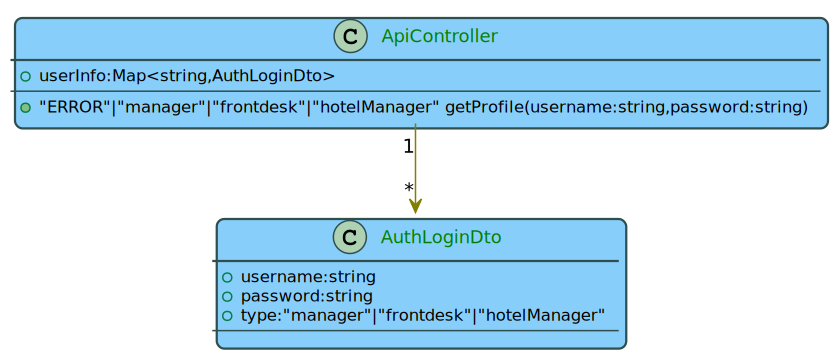
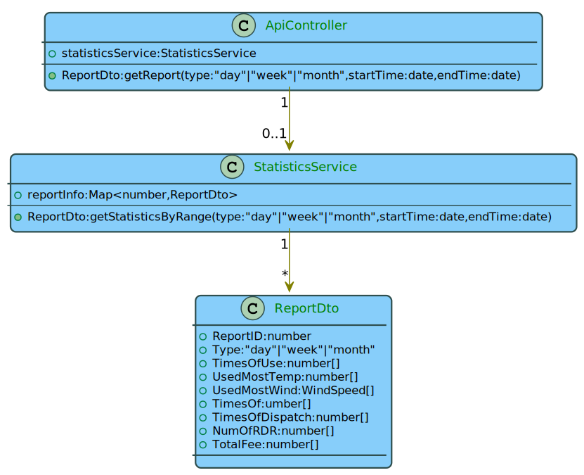
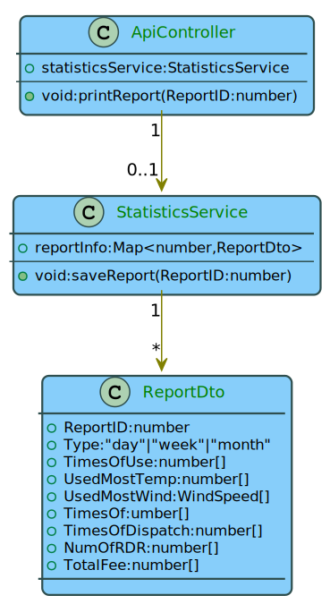
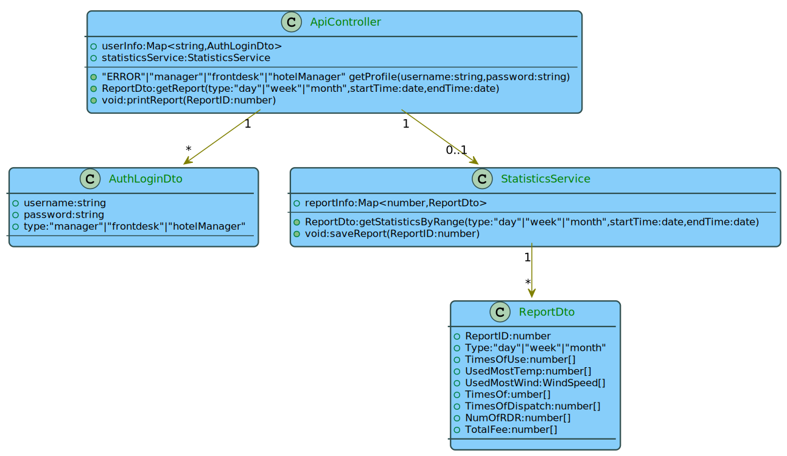

# 酒店经理静态结构设计

##  1.login

### (1)ApiController

| 属性名 | 类型 | 属性说明 |
|--------|------|----------|
| userInfo | Map<string,AuthLoginDto> | 用户名对应用户身份权限信息表 |

| 方法名 | 参数 | 返回值 | 操作说明 |
|--------|------|--------|----------|
| getProfile | 用户名：username:string; 密码：password:string | 身份类型："ERROR"/"manager"/"frontdesk"/"hotelManager" | 检查输入的用户名密码是否正确，若正确则继续查询其对应身份类型 |

### (2)AuthLoginDto

| 属性名 | 类型 | 属性说明 |
|--------|------|----------|
| username | string | 用户名 |
| password | string | 密码 |
| type | "manager"/"frontdesk"/"hotelManager" | 身份类型 |

## 2.QueryReport

### (1)ApiController

| 属性名 | 类型 | 属性说明 |
|--------|------|----------|
| statisticsService | StatisticsService | 统计对象（业务逻辑层） |

| 方法名 | 参数 | 返回值 | 操作说明 |
|--------|------|--------|----------|
| getReport | 报表类型：type:"day"/"week"/"month"; 开始日期：startTime:date; 结束日期：endTime:date | 报表实例：ReportDto | 从业务逻辑层获取所需报表信息 |

### (2)StatisticsService

| 属性名 | 类型 | 属性说明 |
|--------|------|----------|
| reportInfo | Map<number,ReportDto> | 报表编号对应报表信息的列表 |

| 方法名 | 参数 | 返回值 | 操作说明 |
|--------|------|--------|----------|
| getStatisticsByRange | 报表类型：type:"day"/"week"/"month"; 开始日期：startTime:date; 结束日期：endTime:date | 报表实例：ReportDto | 根据选择的报表类型与时间范围统计报表信息，并存入新建的报表实例中，然后将报表实例添加到报表列表中 |

### (3)ReportDto

| 属性名 | 类型 | 属性说明 |
|--------|------|----------|
| ReportID | number | 报表的编号 |
| Type | "day"/"week"/"month" | 报表的类型 |
| TimesOfUse | number[] | 使用空调（一次开关）的次数（数组内一个元素代表一个房间的数据，下同） |
| UsedMostTemp | number[] | 最常用目标温度 |
| UsedMostWind | WindSpeed[] | 最常用风速 |
| TimesOf | number[] | 达到目标温度次数 |
| TimesOfDispatch | number[] | 被调度次数 |
| NumOfRDR | number[] | 详单记录数 |
| TotalFee | number[] | 总费用 |

## 3.PrintReport

### (1)ApiController

| 属性名 | 类型 | 属性说明 |
|--------|------|----------|
| statisticsService | StatisticsService | 统计对象（业务逻辑层） |

| 方法名 | 参数 | 返回值 | 操作说明 |
|--------|------|--------|----------|
| printReport | 报表编号：ReportID:number | 无：void | 打印选定的报表信息 |

### (2)StatisticsService

| 属性名 | 类型 | 属性说明 |
|--------|------|----------|
| reportInfo | Map<number,ReportDto> | 报表编号对应报表信息的列表 |

| 方法名 | 参数 | 返回值 | 操作说明 |
|--------|------|--------|----------|
| saveReport | 报表编号：ReportID:number | 无：void | 将选定的报表信息导出到本地 |

### (3)ReportDto

| 属性名 | 类型 | 属性说明 |
|--------|------|----------|
| ReportID | number | 报表的编号 |
| Type | "day"/"week"/"month" | 报表的类型 |
| TimesOfUse | number[] | 使用空调（一次开关）的次数（数组内一个元素代表一个房间的数据，下同） |
| UsedMostTemp | number[] | 最常用目标温度 |
| UsedMostWind | WindSpeed[] | 最常用风速 |
| TimesOf | number[] | 达到目标温度次数 |
| TimesOfDispatch | number[] | 被调度次数 |
| NumOfRDR | number[] | 详单记录数 |
| TotalFee | number[] | 总费用 |

## 4.静态结构汇总

