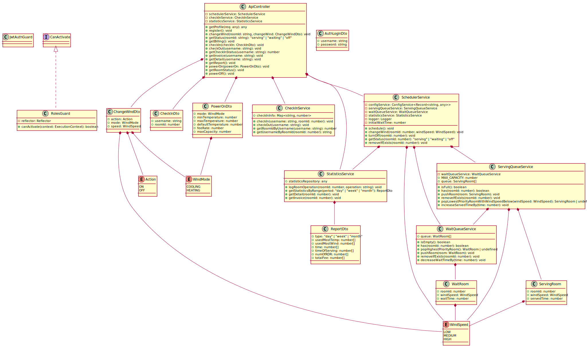
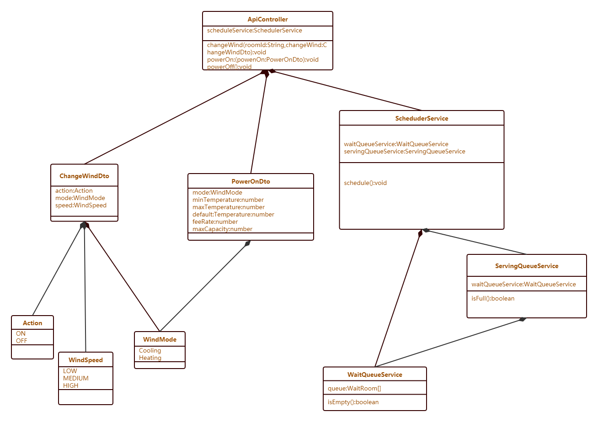

# 分布式温控系统静态结构设计

2017211317 班 C 组

## 迭代历史

| 修改人   | 版本  | 描述                     |
| -------- | ----- | ------------------------ |
| 邱建鑫   | 1.0.0 | 发布文档                 |
| 邱建鑫   | 0.6.0 | 增加系统级静态结构设计   |
| 曾莉慧瑶 | 0.5.0 | 增加前台静态结构设计     |
| 赵子豪   | 0.4.0 | 增加住户静态结构设计     |
| 申茜     | 0.3.0 | 增加酒店经理静态结构设计 |
| 汪桐     | 0.2.0 | 增加管理员静态结构设计   |
| 邱建鑫   | 0.1.0 | 创建文档                 |

## 目录

[TOC]

## 系统级静态结构设计

该系统级静态结构为综合不同角色不同用例之后，合并去重后的系统级静态结构。

静态结构采用控制器模式设计。在分角色的静态结构中，分别对应四个角色控制器类。而在综合至系统静态结构后，为了使系统结构更加简洁，我们将其合并至一个单独的控制器类 `ApiController`。同时，在该类中采用用户角色鉴权的方式来区分控制器类中不同方法的访问权限，阻止非法访问。

之后是业务逻辑层，其中包含诸多领域对象类。为了区分类之间的类别，我们采用了命名规范：

- 以 `*Service` 为结尾命名的类，为主要的软件对象类；
- 以 `*Dto` 为结尾命名的类，为**数据传输对象**（Data Transfer Object），主要用于在不用的领域对象间传输数据。

软件对象类如下：

- `CheckInService`：主要维护客户入住信息，处理客户和房间之间的关联关系；
- `SchedulerService`：主控机调度类，控制不同房间之间的服务状态；
- `ServingQueueService`：服务队列类，保存服务对象 `ServingRoom`；
- `WaitQueueService`：等待队列类，保存等待对象 `WaitRoom`；
- `StatisticsService`：统计信息类，用来在系统运行过程中收集信息，并产生各种统计报表。

数据传输对象包含：

- `AuthLoginDto`：用户登录请求的信息；
- `CheckInDto`：入住请求的信息；
- `ChangeWindDto`：改变风速/温度/模式等请求的信息；
- `PowerOnDto`：管理员配置主控机参数并开机请求的信息；
- `ReportDto`：酒店经理查看统计报表的信息；
- `InvoiceDto`：前台打印详单的信息。

此外还有用户鉴权类：

- `JwtAuthGuard`：用户必须登录，才能进行进一步的任何操作。
- `RolesGuard`：根据用户不同的角色，阻止或放行其对控制器不同方法的访问。

对于持久化层，框架使用数据库 ORM 的方式已经自动提供，这里我们将其略去。

UML 类图如下（为矢量图，可以放大查看）：

对于其中不同方法具体的功能，以及不同类中不同字段的具体信息，为了避免文档冗余，参照接下来的分角色用例静态结构设计。

## 酒店经理静态结构设计

### 1.login

#### (1)ApiController

| 属性名   | 类型                     | 属性说明                     |
| -------- | ------------------------ | ---------------------------- |
| userInfo | Map<string,AuthLoginDto> | 用户名对应用户身份权限信息表 |

| 方法名     | 参数                                              | 返回值                                                 | 操作说明                                                     |
| ---------- | ------------------------------------------------- | ------------------------------------------------------ | ------------------------------------------------------------ |
| getProfile | 用户名：username:string; 密码：password:string | 身份类型："ERROR"/"manager"/"frontdesk"/"hotelManager" | 检查输入的用户名密码是否正确，若正确则继续查询其对应身份类型 |

#### (2)AuthLoginDto

| 属性名   | 类型                                 | 属性说明 |
| -------- | ------------------------------------ | -------- |
| username | string                               | 用户名   |
| password | string                               | 密码     |
| type     | "manager"/"frontdesk"/"hotelManager" | 身份类型 |

### 2.QueryReport

#### (1)ApiController

| 属性名            | 类型              | 属性说明               |
| ----------------- | ----------------- | ---------------------- |
| statisticsService | StatisticsService | 统计对象（业务逻辑层） |

| 方法名    | 参数                                                                                        | 返回值              | 操作说明                     |
| --------- | ------------------------------------------------------------------------------------------- | ------------------- | ---------------------------- |
| getReport | 报表类型：type:"day"/"week"/"month"; 开始日期：startTime:date; 结束日期：endTime:date | 报表实例：ReportDto | 从业务逻辑层获取所需报表信息 |

#### (2)StatisticsService

| 属性名     | 类型                  | 属性说明                   |
| ---------- | --------------------- | -------------------------- |
| reportInfo | Map<number,ReportDto> | 报表编号对应报表信息的列表 |

| 方法名               | 参数                                                                                        | 返回值              | 操作说明                                                                                         |
| -------------------- | ------------------------------------------------------------------------------------------- | ------------------- | ------------------------------------------------------------------------------------------------ |
| getStatisticsByRange | 报表类型：type:"day"/"week"/"month"; 开始日期：startTime:date; 结束日期：endTime:date | 报表实例：ReportDto | 根据选择的报表类型与时间范围统计报表信息，并存入新建的报表实例中，然后将报表实例添加到报表列表中 |

#### (3)ReportDto

| 属性名          | 类型                 | 属性说明                                                             |
| --------------- | -------------------- | -------------------------------------------------------------------- |
| ReportID        | number               | 报表的编号                                                           |
| Type            | "day"/"week"/"month" | 报表的类型                                                           |
| TimesOfUse      | number[]             | 使用空调（一次开关）的次数（数组内一个元素代表一个房间的数据，下同） |
| UsedMostTemp    | number[]             | 最常用目标温度                                                       |
| UsedMostWind    | WindSpeed[]          | 最常用风速                                                           |
| TimesOf         | number[]             | 达到目标温度次数                                                     |
| TimesOfDispatch | number[]             | 被调度次数                                                           |
| NumOfRDR        | number[]             | 详单记录数                                                           |
| TotalFee        | number[]             | 总费用                                                               |

### 3.PrintReport

#### (1)ApiController

| 属性名            | 类型              | 属性说明               |
| ----------------- | ----------------- | ---------------------- |
| statisticsService | StatisticsService | 统计对象（业务逻辑层） |

| 方法名      | 参数                      | 返回值   | 操作说明           |
| ----------- | ------------------------- | -------- | ------------------ |
| printReport | 报表编号：ReportID:number | 无：void | 打印选定的报表信息 |

#### (2)StatisticsService

| 属性名     | 类型                  | 属性说明                   |
| ---------- | --------------------- | -------------------------- |
| reportInfo | Map<number,ReportDto> | 报表编号对应报表信息的列表 |

| 方法名     | 参数                      | 返回值   | 操作说明                   |
| ---------- | ------------------------- | -------- | -------------------------- |
| saveReport | 报表编号：ReportID:number | 无：void | 将选定的报表信息导出到本地 |

#### (3)ReportDto

| 属性名          | 类型                 | 属性说明                                                             |
| --------------- | -------------------- | -------------------------------------------------------------------- |
| ReportID        | number               | 报表的编号                                                           |
| Type            | "day"/"week"/"month" | 报表的类型                                                           |
| TimesOfUse      | number[]             | 使用空调（一次开关）的次数（数组内一个元素代表一个房间的数据，下同） |
| UsedMostTemp    | number[]             | 最常用目标温度                                                       |
| UsedMostWind    | WindSpeed[]          | 最常用风速                                                           |
| TimesOf         | number[]             | 达到目标温度次数                                                     |
| TimesOfDispatch | number[]             | 被调度次数                                                           |
| NumOfRDR        | number[]             | 详单记录数                                                           |
| TotalFee        | number[]             | 总费用                                                               |

### 4.静态结构汇总

## 前台静态结构设计

### Createcheck

#### CheckInService

##### CheckInDto

属性：

 {

 string username;
number roomId;

 }；CheckInService

##### CheckInService

 方法：checkIn(username, roomID)

 创建服务对象

 方法：checkOut(username）

 清除服务对象

 方法：getRoomIdByUsername(username)

 根据住户名获取房间号

 方法：getUsernameByRoomId(roomId)

 根据房间号获取住户名

##### ApiController

 方法：register()

 注册用户

 方法：getCheckInStatus(username)

 获取住户信息

### CreateDetail

##### CheckInDto

 方法：getRoomIdByUsername(username)

 根据住户名获取房间号

 方法：getUsernameByRoomId(roomId)

 根据房间号获取住户名

##### StatisticsService

 方法：getStatisticsByRange(period: "day" | "week" | "month")

 按范围向系统请求账单信息

 方法：getDetail(roomId)

 向系统请求房间状态

 方法：getInvoice(roomId)

 根据房间号向系统请求费用清单并打印

##### ApiController

 方法：getCheckInStatus(username)

 获取用户状态

 方法：getDetail(username)

 获取用户使用信息

 方法：getReport()

 输出信息报告

### CreateInvoice

##### CheckInDto

 方法：checkIn(username, roomID)

 创建服务对象

 方法：checkOut(username）

 清除服务对象

 方法：getRoomIdByUsername(username)

 根据住户名获取房间号

 方法：getUsernameByRoomId(roomId)

 根据房间号获取住户名

##### StatisticsService

 方法：getStatisticsByRange(period: "day" | "week" | "month")

 按范围向系统请求账单信息

 方法：getDetail(roomId)

 向系统请求房间状态

 方法：getInvoice(roomId)

 根据房间号向系统请求费用清单并打印

##### ApiController

 方法：getCheckInStatus(username)

 获取用户状态

 方法：getBilling()

 获取用户消费情况

 方法：getInvoice(username)

 获取用户消费详单

 方法：getReport()

 输出信息报告

### 汇总

 

## 住户用例静态结构设计

### 住户用例静态类图

### 类说明

| 类名 | ApiController                                             |
| ---- | --------------------------------------------------------- |
| 属性 | 1.schedulerService:SchedulerService                       |
| 方法 | 1.changeWind(roomId:String,changeWind:ChangeWindDto):void |
|      | 2.powerOn:(powerOn:PowerOnDto):void                       |
|      | 3.powerOff():void                                         |

| 类名 | ServingQueueService                 |
| ---- | ----------------------------------- |
| 属性 | 1.waitQueueService:WaitQueueService |
| 方法 | 1.isFull():boolean                  |
|      |                                     |

| 类名 | WaitQueueService    |
| ---- | ------------------- |
| 属性 | 1.queue:WaitRoom[]  |
| 方法 | 1.isEmpty():boolean |

| 类名 | SchedulerService                    |
| ---- | ----------------------------------- |
| 属性 | 1.waitQueueService:WaitQueueService |
|      | 2.scheduleService:SchedulerService  |
| 方法 | 1.schedule():void                   |

| 类名 | Action                       |
| ---- | ---------------------------- |
| 属性 | 1.On 布尔类型，表示是否开机  |
|      | 2.Off 布尔类型，表示是否关机 |
| 方法 |                              |

| 类名 | WindMode                         |
| ---- | -------------------------------- |
| 属性 | 1.Cooling 布尔类型，表示是否制冷 |
|      | 2.Heating 布尔类型，表示是否制热 |
| 方法 |                                  |

| 类名 | WindSpeed                     |
| ---- | ----------------------------- |
| 属性 | 1.LOW 布尔类型，表示是否低风  |
|      | 2.MID 布尔类型，表示是否中风  |
|      | 3.HIGH 布尔类型，表示是否高风 |
| 方法 |                               |

| 类名 | ChangeWindDto                                |
| ---- | -------------------------------------------- |
| 属性 | 1.action:Action 包含 action 类来表示是否开机 |
|      | 2.mode:WindMode 包含 Winmode 类来表示模式    |
|      | 3.speed:WindSpeed 包含 WinSpeed 类来表示风速 |
| 方法 |                                              |

| 类名 | PowerOnDto                                |
| ---- | ----------------------------------------- |
| 属性 | 1.mode:WindMode 包含 Winmode 类来表示模式 |
|      | 2.minTemperature:number 表示最小温度      |
|      | 3.maxTemperature:number 表示最大温度      |
|      | 4.defaultTemperature:number 表示默认温度  |
|      | 5.feeRate:number 表示费率                 |
|      | 6.maxCapacity:number 表示最大容量         |
| 方法 |                                           |

## 管理员静态结构设计

### PowerON

#### 1.MaintainerController

| 方法名    | 操作说明   |
| --------- | ---------- |
| PowerOn() | 主控机开机 |

#### 2.Service

| 方法名 | 操作说明 |
| AuthLoginDto(username,password) | 管理员登录 |
| PowerOnDto(mode,minTemperature,maxTemperature,defaultTemperature,feeRate,maxCapacity) | 主控机初始参数设定 |

### B.SetPara

#### 1.MaintainerController

| 方法名    | 操作说明       |
| --------- | -------------- |
| SetPara() | 改变主控机参数 |

#### 2.Service

| 方法名                                                                                | 操作说明       |
| ------------------------------------------------------------------------------------- | -------------- |
| PowerOnDto(mode,minTemperature,maxTemperature,defaultTemperature,feeRate,maxCapacity) | 主控机参数设定 |

### GetInformation

| 方法名          | 操作说明         |
| --------------- | ---------------- |
| GetRoomStates() | 获取所有房间信息 |

### PowerOff

| 方法名     | 操作说明   |
| ---------- | ---------- |
| PowerOff() | 主控机关机 |

### 静态结构汇总

