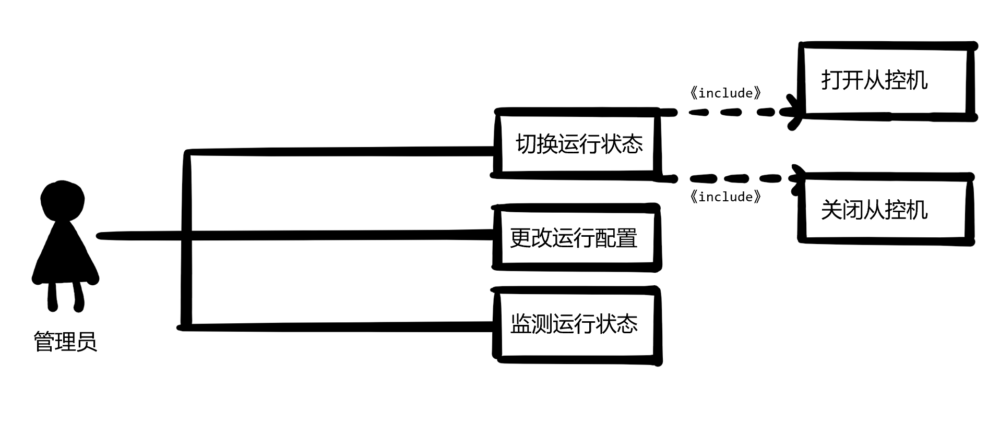
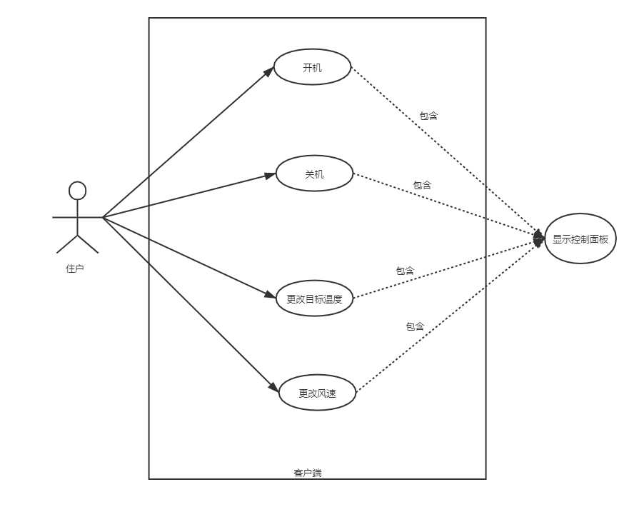
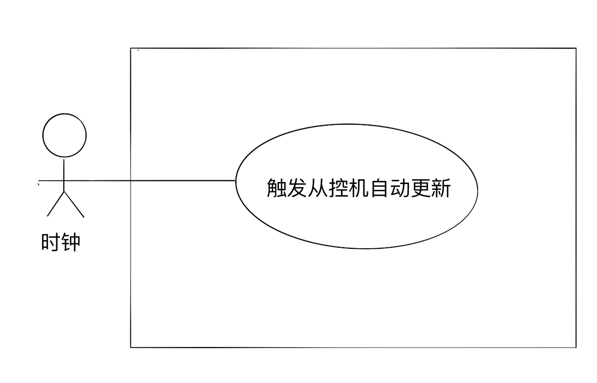
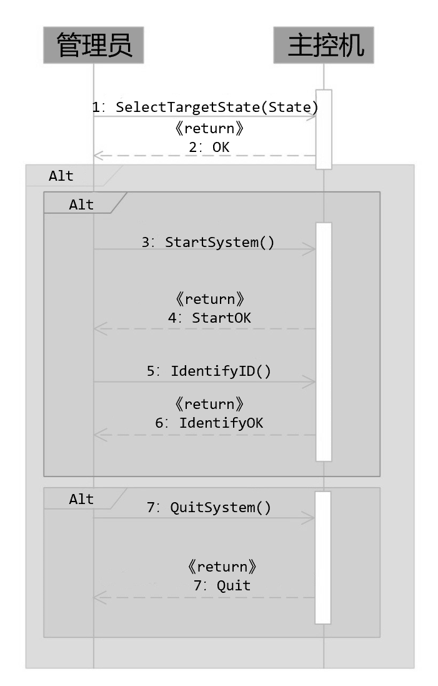
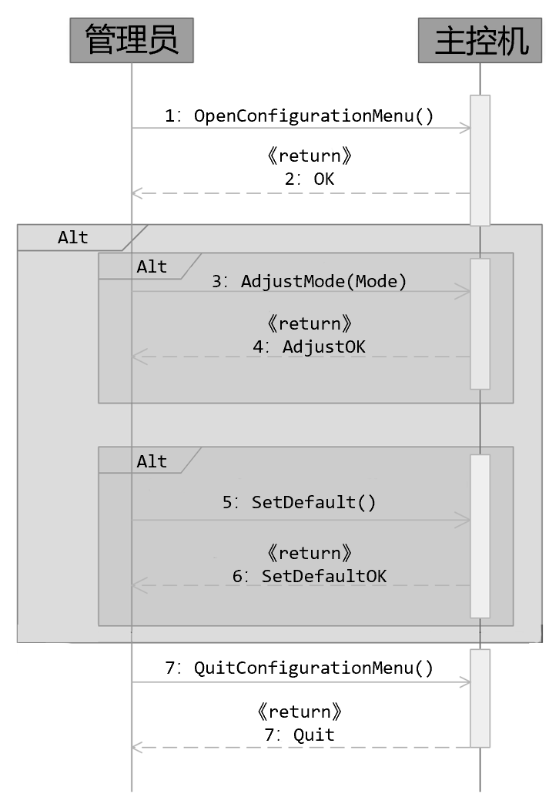
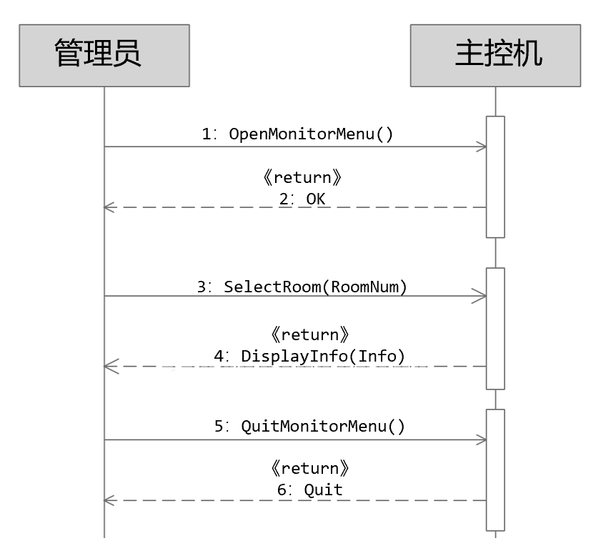
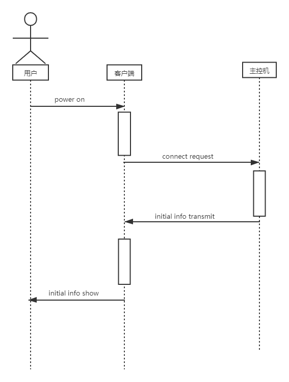
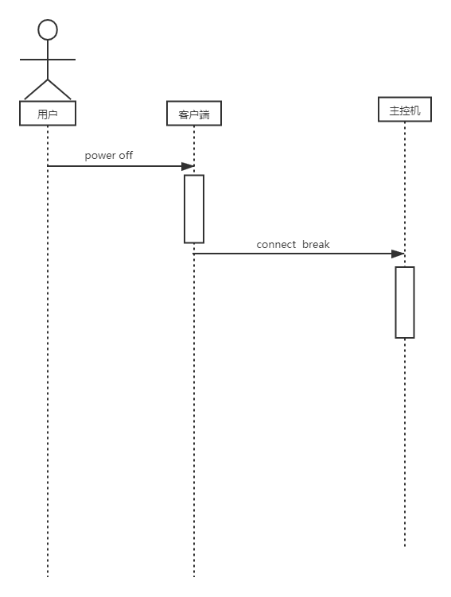
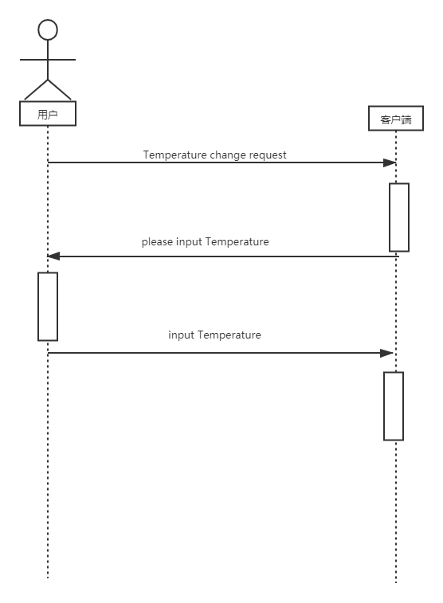
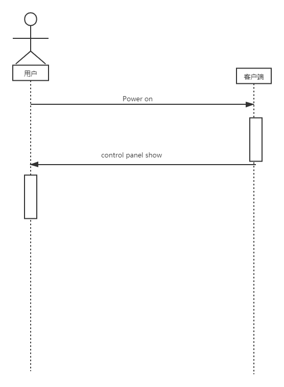

# 分布式温控系统用例模型说明书

## 迭代历史

| 修改人   | 版本  | 描述                 |
| -------- | ----- | -------------------- |
| 邱建鑫   | 1.0.0 | 发布文档             |
| 邱建鑫   | 0.6.0 | 增加时钟角色用例模型 |
| 曾莉慧瑶 | 0.5.0 | 增加前台用例模型     |
| 赵子豪   | 0.4.0 | 增加住户用例模型     |
| 申茜     | 0.3.0 | 增加酒店经理用例模型 |
| 汪桐     | 0.2.0 | 增加管理员用例模型   |
| 邱建鑫   | 0.1.0 | 创建文档             |

## 文档目录

[TOC]

## 文档介绍

### 文档目的

该文档主要的目的建立用例模型。 根据已经确定的需求分析来描述用户以及各个子功能系统之间的交互场景， 对每一个场景建立相应的用例模型， 软件开发人员根据此模型来进行软件的详细设计与开发。

### 文档范围

本系统用例模型的问题域为酒店的分布式温控系统，问题中出现的角色有前台、管理员、住户、酒店经理、时钟五个角色。

### 项目背景

某快捷廉价酒店响应节能绿色环保理念，推行自助计费式中央温控系统，使得入住的客户可以根据要求设定**温度**和**风速**的调节，同时可以**显示所需支付的金额**。客户退房时酒店须出具空调使用的**账单**及**详单**。空调运行期间，空调管理员能够**监控**各房间空调的使用状态，需要的情况下可以生成**格式统计报表**。

## 用例图

### 前台


### 管理员



### 住户



### 酒店经理


### 时钟



## 用例说明

### 前台

| 用例编号             | 001                                                                     |
| -------------------- | ----------------------------------------------------------------------- |
| 用例名称             | 打印账单                                                                |
| 范围                 | 中央空调温控系统                                                        |
| 级别                 | 用户目标级别                                                            |
| 主要参与者           | 前台，住户                                                              |
| 项目相关人员及其兴趣 | 前台：查看住户空调使用详单 住户：查看本人空调使用详单                   |
| 前置条件             | 住户办理退房业务                                                        |
| 后置条件             | 前台打印出住户空调使用详单（账单）                                      |
| 主要成功场景         | 1.客户办理退房业务                                                      |
|                      | 2.前台向系统调取该住户使用空调的费用详单                                |
|                      | 3.系统返回空调费用详单                                                  |
|                      | 4.前台打印空调账单                                                      |
| 扩展（或替代流程)    | 2a.若住户要求打印详单，调取空调使用的费用详单（包括详细记录及费用）     |
|                      | 3a.若住户要求打印详单，系统返回空调使用的费用详单（包括详细记录及费用） |
|                      | 4a.若住户要求打印详单，前台打印详单                                     |
| 特殊需求             | 无                                                                      |
| 发生频率             | 每次住户退房时                                                          |

| 用例编号             | 002                                                                       |
| -------------------- | ------------------------------------------------------------------------- |
| 用例名称             | 打印账单                                                                  |
| 范围                 | 中央空调温控系统                                                          |
| 级别                 | 用户目标级别                                                              |
| 主要参与者           | 前台，经理                                                                |
| 项目相关人员及其兴趣 | 前台：查看各房间空调消费信息，反馈给经理 经理：申请查看各房间空调消费信息 |
| 前置条件             | 住户办理退房业务                                                          |
| 后置条件             | 前台向经理反馈消费信息                                                    |
| 主要成功场景         | 1.经理希望获取客户空调消费信息                                            |
|                      | 2.经理向前台申请查看各房间空调消费信息                                    |
|                      | 3.前台回应请求                                                            |
|                      | 4.前台向系统调取各房间使用空调的消费信息                                  |
|                      | 5.系统返回空调费用详单                                                    |
|                      | 6.前台向经理返回客户的消费信息                                            |
| 扩展（或替代流程)    | 5a.若系统返回失败，回到上一步，并返回错误信息                             |
| 特殊需求             | 无                                                                        |
| 发生频率             | 经理申请查询各房间费用时                                                  |

### 管理员

| 用例编号             | Manager_001                                                     |
| -------------------- | --------------------------------------------------------------- |
| 用例名称             | 切换运行状态                                                    |
| 范围                 | 主控机                                                          |
| 级别                 | 用户目标级别                                                    |
| 主要参与者           | 管理员                                                          |
| 项目相关人员及其兴趣 | 管理员：完成开、关机状态之间的切换                              |
| 前置条件             | 主控机可以正常工作                                              |
| 后置条件             | 主控机切换运行状态                                              |
| 主要成功场景         | 1.管理员选择切换的状态                                          |
|                      | 2.系统成功完成状态的切换，用例结束。                            |
| 扩展（或替代流程)    | 1a.管理员开启主控机系统，转入扩展用例：主控机开机 Manager_001_1 |
|                      | 1b.管理员关闭主控机系统，转入扩展用例：主控机开机 Manager_001_2 |
| 特殊需求             | 无                                                              |
| 发生频率             | 管理员切换主控机运行状态时                                      |

| 用例编号             | Manager_001_1                                                              |
| -------------------- | -------------------------------------------------------------------------- |
| 用例名称             | 主控机开机                                                                 |
| 范围                 | 主控机                                                                     |
| 级别                 | 子功能级别                                                                 |
| 主要参与者           | 管理员                                                                     |
| 项目相关人员及其兴趣 | 管理员：成功打开主控机，使其保持待机状态                                   |
| 前置条件             | 主控机处于关闭状态                                                         |
| 后置条件             | 主控机打开，进入待机状态                                                   |
| 主要成功场景         | 1.管理员发出开机指令                                                       |
|                      | 2.管理员验证身份                                                           |
|                      | 3.主控机开机成功，进入管理员界面，用例结束。                               |
| 扩展（或替代流程)    | 2a.管理员用户名或密码错误，身份认证失败，重新认证。系统重新进入成功场景 1  |
|                      | 2b.管理员身份认证失败超过三次，主控机系统锁定。系统重新进入成功场景 1      |
|                      | 2c.主控机系统锁定。使用预设 PIN 码解锁系统，重设管理员账户，返回成功场景 1 |
| 特殊需求             | 无                                                                         |
| 发生频率             | 管理员打开主控机时                                                         |

| 用例编号             | Manager_001_2                    |
| -------------------- | -------------------------------- |
| 用例名称             | 主控机关机                       |
| 范围                 | 主控机                           |
| 级别                 | 子功能级别                       |
| 主要参与者           | 管理员                           |
| 项目相关人员及其兴趣 | 管理员：成功关闭主控机           |
| 前置条件             | 主控机处于开启状态               |
| 后置条件             | 主控机关闭                       |
| 主要成功场景         | 1.管理员发出关机指令             |
|                      | 2.主控机停止服务，记录日志       |
|                      | 3.主控机向所有从控机发送关机指令 |
|                      | 4.主控机成功关闭，用例结束       |
| 扩展（或替代流程)    | 无                               |
| 特殊需求             | 无                               |
| 发生频率             | 管理员关闭主控机时               |

| 用例编号             | Manager_002                           |
| -------------------- | ------------------------------------- |
| 用例名称             | 更改运行配置                          |
| 范围                 | 主控机                                |
| 级别                 | 用户目标级别                          |
| 主要参与者           | 管理员                                |
| 项目相关人员及其兴趣 | 管理员：更改主控机系统选项及参数配置  |
| 前置条件             | 主控机处于开启状态                    |
| 后置条件             | 主控机配置更改成功                    |
| 主要成功场景         | 1.管理员进入配置更改界面              |
|                      | 2.管理员选择想要更改的配置            |
|                      | 3.管理员输入新的参数选项并提交        |
|                      | 4.系统完成新参数选项的配置，用例结束  |
| 扩展（或替代流程)    | 2a.管理员切换主控机供暖、制冷工作状态 |
|                      | 2b.管理员切换不同风速                 |
|                      | 2c.系统初始化默认配置                 |
| 特殊需求             | 无                                    |
| 发生频率             | 管理员更改主控机运行配置时            |

| 用例编号             | Manager_003                                            |
| -------------------- | ------------------------------------------------------ |
| 用例名称             | 监测运行状态                                           |
| 范围                 | 主控机                                                 |
| 级别                 | 用户目标级别                                           |
| 主要参与者           | 管理员                                                 |
| 项目相关人员及其兴趣 | 管理员：监测从控机的运行状态                           |
| 前置条件             | 主控机处于开启状态                                     |
| 后置条件             | 从控机状态监测结果                                     |
| 主要成功场景         | 1.管理员进入监测界面                                   |
|                      | 2.管理员选择想要查看的房间号                           |
|                      | 3.主控机系统显示房间当前温度、从控机目标温度及设置风速 |
|                      | 4.得到从控机状态监测结果，用例结束                     |
| 扩展（或替代流程)    | \*a.从控机状态异常，进行故障排查和维护                 |
| 特殊需求             | 无                                                     |
| 发生频率             | 管理员监测从控机运行状态时                             |

### 住户

1.开机
| 用例编号 |User_01 |
| -------------------- | --- |
| 用例名称 |开机 |
| 范围 |分布式温控系统 |
| 级别 |用例 |
| 主要参与者 |住户，客户端 |
| 项目相关人员及其兴趣 | |
| 前置条件 |主控端开启，住户已经注册房间 |
| 后置条件 |开机成功，从控机和主控机建立连接并用来收发送风请求，将信息（当前温度，目标温度等）显示在客户端控制面板上； |
| 主要成功场景 | 1. 用户点击开机按钮 |
| | 2. 开机成功，从控机和主控机建立连接，显示当前温度到客户端控制面板上 |
| 扩展（或替代流程) | |
| | |
| 特殊需求 | |
| 发生频率 | |

2.关机
| 用例编号 |User_02 |
| -------------------- | --- |
| 用例名称 |关机 |
| 范围 |分布式温控系统 |
| 级别 |用例 |
| 主要参与者 |住户，客户端 |
| 项目相关人员及其兴趣 | |
| 前置条件 |主控端开启 |
| 后置条件 |从控机关闭|
| 主要成功场景 | 1. 用户点击关机按钮 |
| | 2. 从控机断开与主控机联系，不在收发送风请求 |
| 扩展（或替代流程) | |
| | |
| 特殊需求 | |
| 发生频率 | |

3.更改目标温度
| 用例编号 |User_03 |
| -------------------- | --- |
| 用例名称 |更改目标温度 |
| 范围 |分布式温控系统 |
| 级别 |用例 |
| 主要参与者 |住户，客户端 |
| 项目相关人员及其兴趣 | |
| 前置条件 |主控机开启，从控机开启，主控机和从控机建立连接 |
| 后置条件 |用户输入目标温度成功，客户端将这一温度（送风）请求发送给主控机|
| 主要成功场景 | 1. 用户输入温度 |
| | 2. 从控机接收到目标温度，并发送给主控机温度请求 |
| 扩展（或替代流程) | 1a.用户输入的目标温度间隔小于一定间隔，从控机只响应最近一次温度 |
| | |
| 特殊需求 | |
| 发生频率 | |

4.更改风速
| 用例编号 |User_04 |
| -------------------- | --- |
| 用例名称 |更改风速 |
| 范围 |分布式温控系统 |
| 级别 |用例 |
| 主要参与者 |住户，客户端 |
| 项目相关人员及其兴趣 | |
| 前置条件 |主控机开启，从控机开启，主控机和从控机建立连接 |
| 后置条件 |用户输入目标风速成功，客户端将这一风速（送风）请求发送给主控机|
| 主要成功场景 | 1. 用户输入风速 |
| | 2. 从控机接收并保存风速信息，发送给主控机送风请求 |
| 扩展（或替代流程) | 1a.用户输入的目标风速间隔小于一定间隔，只响应一秒内最近的一次。 |
| | |
| 特殊需求 | |
| 发生频率 | |

5.显示控制面板
| 用例编号 |User_05 |
| -------------------- | --- |
| 用例名称 |显示控制面板 |
| 范围 |分布式温控系统 |
| 级别 |用例 |
| 主要参与者 |住户，客户端 |
| 项目相关人员及其兴趣 | |
| 前置条件 |主控机开启，用户已经注册房间 |
| 后置条件 |控制面板成功显示|
| 主要成功场景 | 1. 客户端显示控制面板|
| | |
| 扩展（或替代流程) | |
| | |
| 特殊需求 | |
| 发生频率 | |

### 酒店经理

| 用例编号             | Uc_hotelManager_001                                                                                                                                                                                        |
| -------------------- | ---------------------------------------------------------------------------------------------------------------------------------------------------------------------------------------------------------- |
| 用例名称             | 查看报表                                                                                                                                                                                                   |
| 范围                 | 分布式温控系统                                                                                                                                                                                             |
| 级别                 | 用户目标级别                                                                                                                                                                                               |
| 主要参与者           | 酒店经理                                                                                                                                                                                                   |
| 项目相关人员及其兴趣 | 酒店经理：查看酒店空调一段时间内的消费和使用情况                                                                                                                                                           |
| 前置条件             | 服务端处于开启且可用状态，且经理要查看报表                                                                                                                                                                 |
| 后置条件             | 显示统计报表                                                                                                                                                                                               |
| 主要成功场景         | 1. 酒店经理使用服务端开始查看报表                                                                                                                                                                          |
|                      | 2. 包含用例：登录系统 Uc_hotelManager_001_1                                                                                                                                                                |
|                      | 3. 酒店经理选择查看报表                                                                                                                                                                                    |
|                      | 4. 系统弹出报表类型和时间选择窗口                                                                                                                                                                          |
|                      | 5. 酒店经理选择报表类型和具体时间                                                                                                                                                                          |
|                      | 6. 酒店经理确认选择正确，点击确认按钮                                                                                                                                                                      |
|                      | 7. 系统验证报表选项合法                                                                                                                                                                                    |
|                      | 8. 系统生成所选报表，并显示到屏幕上，包含用例：生成报表 Uc_hotelManager_001_2                                                                                                                              |
|                      | 9. 酒店经理查看报表，若选择打印报表则转扩展用例：打印报表 Uc_hotelManager_001_3；                                                                                                                          |
|                      | 10. 报表查看完成，用例结束                                                                                                                                                                                 |
| 扩展（或替代流程)    | \*a. 系统在任意时刻失败。<br>系统记录错误日志，并向酒店经理提示错误。<br>酒店经理根据错误严重程度选择：<br>（1）再次发出相同请求；<br>（2）重启系统，登录，再次进行相同操作；<br>（3）请维修人员维修系统； |
|                      | \*b. 查询过程中，酒店经理可随时取消查询                                                                                                                                                                    |
|                      | 6a. 酒店经理发现选择错误，选择更改报表类型或具体时间，返回主要成功场景的步骤 5                                                                                                                             |
|                      | 7a. 系统验证发现报表选项不合法，提示出错，返回主要成功场景的步骤 5                                                                                                                                         |
|                      | 9a. 酒店经理发现当前报表不是自己想要的报表，或者想要查看新的报表，选择生成新报表，返回主要成功场景的步骤 5                                                                                                 |
| 特殊需求             | 系统在酒店经理发出请求 3 秒内反应                                                                                                                                                                          |
| 发生频率             | 酒店经理每次要查看报表时使用                                                                                                                                                                               |

| 用例编号          | Uc_hotelManager_001_1                                                                                                                                                                                      |
| ----------------- | ---------------------------------------------------------------------------------------------------------------------------------------------------------------------------------------------------------- |
| 用例名称          | 登录系统                                                                                                                                                                                                   |
| 级别              | 子功能级别                                                                                                                                                                                                 |
| 主要成功场景      | 1. 酒店经理打开系统登录界面                                                                                                                                                                                |
|                   | 2. 酒店经理输入用户名和密码                                                                                                                                                                                |
|                   | 3. 酒店经理确认输入正确，点击登录按钮                                                                                                                                                                      |
|                   | 4. 系统验证用户名和密码是否正确                                                                                                                                                                            |
|                   | 5. 系统查询该用户对应操作权限，并开放对应功能                                                                                                                                                              |
|                   | 6. 登录成功，进入系统使用界面                                                                                                                                                                              |
|                   | 7. 登录系统完成，用例结束                                                                                                                                                                                  |
| 扩展（或替代流程) | \*a. 系统在任意时刻失败。<br>系统记录错误日志，并向酒店经理提示错误。<br>酒店经理根据错误严重程度选择：<br>（1）再次发出相同请求；<br>（2）重启系统，登录，再次进行相同操作；<br>（3）请维修人员维修系统； |
|                   | 2a.3a. 登录之前，酒店经理可随时取消登录                                                                                                                                                                    |
|                   | 3b. 酒店经理发现输入错误，选择更改用户名或密码，返回主要成功场景的步骤 1                                                                                                                                   |
|                   | 4a. 系统验证发现用户名或密码错误，提示出错，返回主要成功场景的步骤 1                                                                                                                                       |

| 用例编号          | Uc_hotelManager_001_2                                                                                                                                                                                      |
| ----------------- | ---------------------------------------------------------------------------------------------------------------------------------------------------------------------------------------------------------- |
| 用例名称          | 生成报表                                                                                                                                                                                                   |
| 级别              | 子功能级别                                                                                                                                                                                                 |
| 主要成功场景      | 1. 系统根据酒店经理选择的时间范围，找到对应时间的酒店空调消费和使用信息                                                                                                                                    |
|                   | 2. 系统根据酒店经理选择的报表类型（日报表/周报表/月报表），按对应的格式将这些信息统计汇总到一张表格中                                                                                                      |
|                   | 3. 生成报表完成，用例结束                                                                                                                                                                                  |
| 扩展（或替代流程) | \*a. 系统在任意时刻失败。<br>系统记录错误日志，并向酒店经理提示错误。<br>酒店经理根据错误严重程度选择：<br>（1）再次发出相同请求；<br>（2）重启系统，登录，再次进行相同操作；<br>（3）请维修人员维修系统； |

| 用例编号          | Uc_hotelManager_001_3                                                                                                                                                                                      |
| ----------------- | ---------------------------------------------------------------------------------------------------------------------------------------------------------------------------------------------------------- |
| 用例名称          | 打印报表                                                                                                                                                                                                   |
| 级别              | 子功能级别                                                                                                                                                                                                 |
| 主要成功场景      | 1. 酒店经理选择打印格式                                                                                                                                                                                    |
|                   | 2. 酒店经理确认打印格式正确，点击确认按钮                                                                                                                                                                  |
|                   | 3. 系统连接打印机，根据酒店经理选择的打印格式，发出打印报表请求                                                                                                                                            |
|                   | 4. 打印机响应系统请求，打印出报表                                                                                                                                                                          |
|                   | 5. 打印报表完成，用例结束                                                                                                                                                                                  |
| 扩展（或替代流程) | \*a. 系统在任意时刻失败。<br>系统记录错误日志，并向酒店经理提示错误。<br>酒店经理根据错误严重程度选择：<br>（1）再次发出相同请求；<br>（2）重启系统，登录，再次进行相同操作；<br>（3）请维修人员维修系统； |
|                   | 1a.2a. 打印之前，酒店经理可随时取消打印                                                                                                                                                                    |
|                   | 2b. 酒店经理发现选择错误，选择更改打印格式，返回主要成功场景的步骤 1                                                                                                                                       |

### 时钟

| 用例编号             | UC_Clock_001                                                          |
| -------------------- | --------------------------------------------------------------------- |
| 用例名称             | 触发从控机子系统的自动更新功能                                        |
| 范围                 | 分布式中央空调控制系统从控机子系统                                    |
| 级别                 | 用户目标级别                                                          |
| 主要参与者           | 计时器（时钟）                                                        |
| 项目相关人员及其兴趣 | 时钟：周期性发送脉冲出发从控机子系统自动更新                          |
| 前置条件             | 中央空调主控机处于开启状态，中央空调从控机处于开启状态，用户登陆成功  |
| 后置条件             | 从控机更新显示的中央空调工作模式，工作温度，能量消耗和金额等信息      |
| 主要成功场景         | 1. 计时器周期性地向从控机系统发送脉冲，触发从控机子系统的自动更新功能 |
| 扩展（或替代流程)    | \*a. 停电，等待来电                                                   |
|                      | \*b. 系统崩溃，等待系统管理员处理突发事件                             |
|                      | \*c. 时钟在任意时刻发送脉冲失败，等待系统重启                         |
| 特殊需求             | 无                                                                    |
| 发生频率             | 每隔周期 T 发生                                                       |

## 系统顺序图

### 前台


### 管理员





### 住户

住户用例 1 系统顺序图：开机


住户用例 2 系统顺序图：关机


住户用例 3 系统顺序图：更改温度


住户用例 4 系统顺序图：更改风速


住户用例 5 系统顺序图：显示控制面板


### 酒店经理


### 时钟

```sequence
时钟->从控机: 1. HeartBeat()
从控机-->时钟: 《return》OK
```

## 操作契约

### 前台

| 系统事件 | PrintBill()            |
| -------- | ---------------------- |
| 交叉引用 | 打印账单               |
| 前置条件 | 住户办理退房业务       |
| 后置条件 | 1.新账单被创建         |
|          | 2.账单与前台建立“关联” |
|          | 3.账单属性初始化       |

| 系统事件 | ConsumeQuery()         |
| -------- | ---------------------- |
| 交叉引用 | 查看消费信息           |
| 前置条件 | 客户办理结账业务       |
| 后置条件 | 1.新查询结果被创建     |
|          | 2.经理与前台建立“关联” |

| 系统事件 | AskforConsume()                  |
| -------- | -------------------------------- |
| 交叉引用 | 查看消费信息                     |
| 前置条件 | 经理向前台申请查看各房间消费记录 |
| 后置条件 | 1.新查询结果被创建               |
|          | 2.经理与前台建立“关联”           |
|          | 3.前台与系统建立“关联”           |

### 管理员

| 系统事件 | SelectTargetState(State)             |
| -------- | ------------------------------------ |
| 交叉引用 | 切换运行状态 Manager_001             |
| 前置条件 | 主控机状态正常，管理员使用主控机     |
| 后置条件 | 1.管理员与主控机建立关联             |
|          | 2.管理员与主控机状态切换界面建立关联 |

| 系统事件 | StartSystem()                  |
| -------- | ------------------------------ |
| 交叉引用 | 主控机开机 Manager_001_1       |
| 前置条件 | 主控机关闭                     |
| 后置条件 | 管理员与主控机欢迎界面建立关联 |

| 系统事件 | IdentifyID()                     |
| -------- | -------------------------------- |
| 交叉引用 | 主控机开机 Manager_001_1         |
| 前置条件 | 主控机开启                       |
| 后置条件 | 1.管理员验证身份成功             |
|          | 2.管理员与主控机功能界面建立关联 |

| 系统事件 | QuitSystem()                   |
| -------- | ------------------------------ |
| 交叉引用 | 主控机关机 Manager_001_2       |
| 前置条件 | 主控机开启                     |
| 后置条件 | 管理员与主控机功能界面解除关联 |

| 系统事件 | OpenConfigurationMenu()            |
| -------- | ---------------------------------- |
| 交叉引用 | 更改运行配置 Manager_002           |
| 前置条件 | 主控机开启，管理员使用主控机       |
| 后置条件 | 管理员与主控机配置管理界面建立关联 |

| 系统事件 | AdjustMode(Mode)               |
| -------- | ------------------------------ |
| 交叉引用 | 更改运行配置 Manager_002       |
| 前置条件 | 主控机开启，管理员更改运行配置 |
| 后置条件 | 1.运行配置与主控机建立关联     |
|          | 2.运行配置修改为目标值         |

| 系统事件 | SetDefault()                   |
| -------- | ------------------------------ |
| 交叉引用 | 更改运行配置 Manager_002       |
| 前置条件 | 主控机开启，管理员更改运行配置 |
| 后置条件 | 1.运行配置与主控机建立关联     |
|          | 2.运行配置修改为默认值         |

| 系统事件 | QuitConfigurationMenu()            |
| -------- | ---------------------------------- |
| 交叉引用 | 更改运行配置 Manager_002           |
| 前置条件 | 主控机开启，管理员使用主控机       |
| 后置条件 | 管理员与主控机配置管理界面解除关联 |

| 系统事件 | OpenMonitorMenu()                  |
| -------- | ---------------------------------- |
| 交叉引用 | 监控运行状态 Manager_003           |
| 前置条件 | 主控机开启，管理员使用主控机       |
| 后置条件 | 管理员与从控机状态监测界面建立关联 |

| 系统事件 | SelectRoom(RoomNum)        |
| -------- | -------------------------- |
| 交叉引用 | 监控运行状态 Manager_003   |
| 前置条件 | 管理员选中从控机           |
| 后置条件 | 目标从控机与主控机建立关联 |

| 系统事件 | DisplayInfo(Info)          |
| -------- | -------------------------- |
| 交叉引用 | 监控运行状态 Manager_003   |
| 前置条件 | 主控机获得从控机状态       |
| 后置条件 | 1.显示从控机当前温度       |
|          | 2.显示从控机目标温度及风速 |

| 系统事件 | QuitMonitorMenu()                    |
| -------- | ------------------------------------ |
| 交叉引用 | 监控运行状态 Manager_003             |
| 前置条件 | 主控机监测从控机状态                 |
| 后置条件 | 1.目标从控机与主控机解除关联         |
|          | 2.管理员与从控机状态监测界面解除关联 |

### 住户

| 系统事件 | Power on   |
| -------- | ---------- |
| 交叉引用 | 开机       |
| 前置条件 | 主控机开启 |
| 后置条件 | 从控机开启 |

| 系统事件 | Connect request                      |
| -------- | ------------------------------------ |
| 交叉引用 | 开机                                 |
| 前置条件 | 从控机开启                           |
| 后置条件 | 从控机和主控机建立联系，收发送风请求 |

| 系统事件 | Initial Info transmit                                  |
| -------- | ------------------------------------------------------ |
| 交叉引用 | 开机                                                   |
| 前置条件 | 从控机和主控建立联系                                   |
| 后置条件 | 主控机将从控机的初始配置信息（风速，温度）发送给从控机 |

| 系统事件 | Initial Info show                                      |
| -------- | ------------------------------------------------------ |
| 交叉引用 | 开机                                                   |
| 前置条件 | 主控机将从控机的初始配置信息（风速，温度）发送给从控机 |
| 后置条件 | 控制面板显示从控机初始配置信息                         |

| 系统事件 | Power off                |
| -------- | ------------------------ |
| 交叉引用 | 关机                     |
| 前置条件 | 用户按下关机按钮         |
| 后置条件 | 从控机响应用户的关机请求 |

| 系统事件 | Connect break            |
| -------- | ------------------------ |
| 交叉引用 | 关机                     |
| 前置条件 | 从控机响应用户的关机请求 |
| 后置条件 | 从控机和主控机断开连接   |

| 系统事件 | Temperature change request                     |
| -------- | ---------------------------------------------- |
| 交叉引用 | 更改目标温度                                   |
| 前置条件 | 从控机开启                                     |
| 后置条件 | 从控机接收温度更改请求，并要求用户输入目标温度 |

| 系统事件 | Please input temperature   |
| -------- | -------------------------- |
| 交叉引用 | 更改目标温度               |
| 前置条件 | 从控机要求用户输入目标温度 |
| 后置条件 | 用户输入目标温度           |

| 系统事件 | Input temperature                                  |
| -------- | -------------------------------------------------- |
| 交叉引用 | 更改目标温度                                       |
| 前置条件 | 用户输入目标温度                                   |
| 后置条件 | 从控机记录新的目标温度，并发送给主控机新的送风请求 |

| 系统事件 | Speed change request                               |
| -------- | -------------------------------------------------- |
| 交叉引用 | 更改风速                                           |
| 前置条件 | 从控机开启                                         |
| 后置条件 | 从控机接收风速更改请求，并要求用户输入新的目标风速 |

| 系统事件 | Please input speed         |
| -------- | -------------------------- |
| 交叉引用 | 更改风速                   |
| 前置条件 | 从控机要求用户输入目标风速 |
| 后置条件 | 用户输入目标风速           |

| 系统事件 | Input speed                                        |
| -------- | -------------------------------------------------- |
| 交叉引用 | 更改目标温度                                       |
| 前置条件 | 用户输入目标风速                                   |
| 后置条件 | 从控机记录新的目标风速，并发送给主控机新的送风请求 |

| 系统事件 | control panel show                                                               |
| -------- | -------------------------------------------------------------------------------- |
| 交叉引用 | 显示控制面板                                                                     |
| 前置条件 | 从控机已经开机                                                                   |
| 后置条件 | 客户端将当前温度，目标温度和目标风速显示在屏幕上，并提供用户修改温度和风速的按钮 |

### 酒店经理

| 系统事件 | OpenLoginInterface()                        |
| -------- | ------------------------------------------- |
| 交叉引用 | 登录系统                                    |
| 前置条件 | 服务端处于开启且可用状态                    |
| 后置条件 | 1. 一个新的（概念类）管理员登录模块建立     |
|          | 2. 管理员登录模块的属性初始化：用户名、密码 |

| 系统事件 | Login(username,password)                                      |
| -------- | ------------------------------------------------------------- |
| 交叉引用 | 登录系统                                                      |
| 前置条件 | 管理员登录模块已打开                                          |
| 后置条件 | 1. 一个新的（概念类）管理员使用模块建立                       |
|          | 2. 管理员使用模块与（概念类）管理员建立“关联”                 |
|          | 3. 管理员使用模块与（概念类）管理员登录模块建立“关联”         |
|          | 4. 管理员登录模块的属性被修改：用户名、密码                   |
|          | 5. 管理员使用模块的属性初始化：可用功能（根据管理员权限设置） |

| 系统事件 | ViewReport()                                            |
| -------- | ------------------------------------------------------- |
| 交叉引用 | 查看报表                                                |
| 前置条件 | 酒店经理身份验证通过，开始查看报表                      |
| 后置条件 | 1. 一个新的（概念类）报表建立                           |
|          | 2. 报表与（概念类）管理员使用模块建立“关联”             |
|          | 3. 报表的属性初始化：报表号、建立时间、存储信息的数组等 |

| 系统事件 | SetReportOption(type,period)  |
| -------- | ----------------------------- |
| 交叉引用 | 查看报表                      |
| 前置条件 | 酒店经理正在设置报表选项      |
| 后置条件 | 报表的属性被修改：type,period |

| 系统事件 | Display(ReportNo)             |
| -------- | ----------------------------- |
| 交叉引用 | 查看报表                      |
| 前置条件 | 酒店经理将报表选项设置完毕    |
| 后置条件 | 报表的属性被修改：isDisplayed |

| 系统事件 | PrintReport(ReportNo)                |
| -------- | ------------------------------------ |
| 交叉引用 | 查看报表                             |
| 前置条件 | 酒店经理正在查看报表，并选择打印报表 |
| 后置条件 | 报表属性被修改：isPrinted            |

| 系统事件 | EndReport()                          |
| -------- | ------------------------------------ |
| 交叉引用 | 查看报表                             |
| 前置条件 | 酒店经理完成查看报表，并选择关闭报表 |
| 后置条件 | 1. 报表与酒店建立“关联”              |
|          | 2. 报表属性被修改：isViewed          |

| 系统事件 | HeartBeat()                          |
| -------- | ------------------------------------ |
| 交叉引用 | 自动更新                             |
| 前置条件 | 中央空调主控机处于开启状态，中央空调从控机处于开启状态，用户登陆成功        |
| 后置条件 | 从控机更新显示的中央空调工作模式，工作温度，能量消耗和金额等信息            |