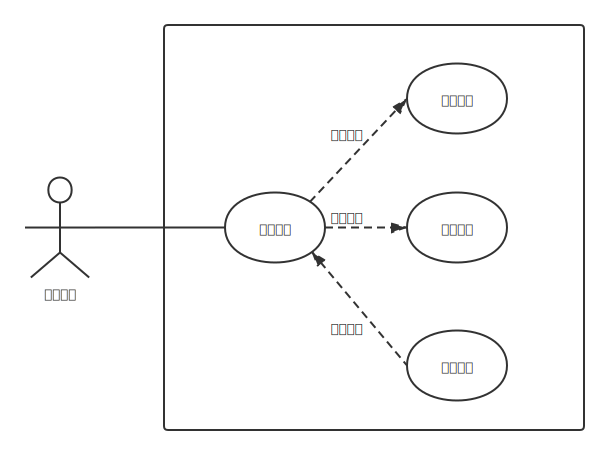
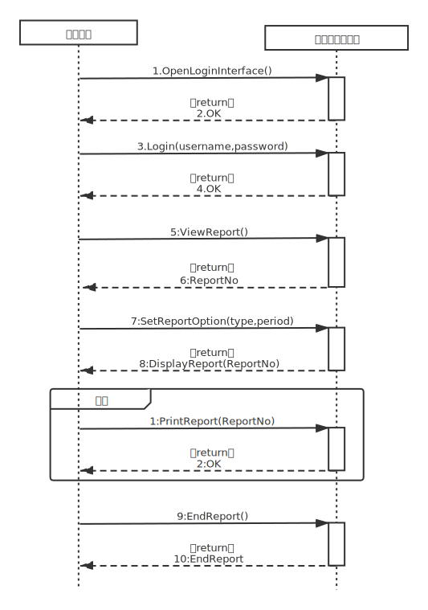

# 酒店经理用例模型

## 用例图

## 用例描述

| 用例编号             | Uc_hotelManager_001 |
| -------------------- | --- |
| 用例名称             | 查看报表 |
| 范围                 | 分布式温控系统 |
| 级别                 | 用户目标级别 |
| 主要参与者           | 酒店经理 |
| 项目相关人员及其兴趣 | 酒店经理：查看酒店空调一段时间内的消费和使用情况 |
| 前置条件             | 服务端处于开启且可用状态，且经理要查看报表 |
| 后置条件             | 显示统计报表 |
| 主要成功场景         | 1. 酒店经理使用服务端开始查看报表 |
|                      | 2. 包含用例：登录系统 Uc_hotelManager_001_1 |
|                      | 3. 酒店经理选择查看报表 |
|                      | 4. 系统弹出报表类型和时间选择窗口 |
|                      | 5. 酒店经理选择报表类型和具体时间 |
|                      | 6. 酒店经理确认选择正确，点击确认按钮 |
|                      | 7. 系统验证报表选项合法 |
|                      | 8. 系统生成所选报表，并显示到屏幕上，包含用例：生成报表 Uc_hotelManager_001_2 |
|                      | 9. 酒店经理查看报表，若选择打印报表则转扩展用例：打印报表 Uc_hotelManager_001_3； |
|                      | 10. 报表查看完成，用例结束 |
| 扩展（或替代流程)    | *a. 系统在任意时刻失败。 系统记录错误日志，并向酒店经理提示错误。 酒店经理根据错误严重程度选择： （1）再次发出相同请求； （2）重启系统，登录，再次进行相同操作； （3）请维修人员维修系统； |
|                      | *b. 查询过程中，酒店经理可随时取消查询 |
|                      | 6a. 酒店经理发现选择错误，选择更改报表类型或具体时间，返回主要成功场景的步骤5 |
|                      | 7a. 系统验证发现报表选项不合法，提示出错，返回主要成功场景的步骤5 |
|                      | 9a. 酒店经理发现当前报表不是自己想要的报表，或者想要查看新的报表，选择生成新报表，返回主要成功场景的步骤5 |
| 特殊需求             | 系统在酒店经理发出请求3秒内反应 |
| 发生频率             | 酒店经理每次要查看报表时使用 |

| 用例编号             | Uc_hotelManager_001_1 |
| -------------------- | --- |
| 用例名称             | 登录系统 |
| 级别                 | 子功能级别 |
| 主要成功场景         | 1. 酒店经理打开系统登录界面 |
|                      | 2. 酒店经理输入用户名和密码 |
|                      | 3. 酒店经理确认输入正确，点击登录按钮 |
|                      | 4. 系统验证用户名和密码是否正确 |
|                      | 5. 系统查询该用户对应操作权限，并开放对应功能 |
|                      | 6. 登录成功，进入系统使用界面 |
|                      | 7. 登录系统完成，用例结束 |
| 扩展（或替代流程)    | *a. 系统在任意时刻失败。 系统记录错误日志，并向酒店经理提示错误。 酒店经理根据错误严重程度选择： （1）再次发出相同请求； （2）重启系统，登录，再次进行相同操作； （3）请维修人员维修系统； |
|                      | 2a.3a. 登录之前，酒店经理可随时取消登录 |
|                      | 3b. 酒店经理发现输入错误，选择更改用户名或密码，返回主要成功场景的步骤1 |
|                      | 4a. 系统验证发现用户名或密码错误，提示出错，返回主要成功场景的步骤1 |

| 用例编号             | Uc_hotelManager_001_2 |
| -------------------- | --- |
| 用例名称             | 生成报表 |
| 级别                 | 子功能级别 |
| 主要成功场景         | 1. 系统根据酒店经理选择的时间范围，找到对应时间的酒店空调消费和使用信息 |
|                      | 2. 系统根据酒店经理选择的报表类型（日报表/周报表/月报表），按对应的格式将这些信息统计汇总到一张表格中 |
|                      | 3. 生成报表完成，用例结束 |
| 扩展（或替代流程)    | *a. 系统在任意时刻失败。 系统记录错误日志，并向酒店经理提示错误。 酒店经理根据错误严重程度选择： （1）再次发出相同请求； （2）重启系统，登录，再次进行相同操作； （3）请维修人员维修系统； |

| 用例编号             | Uc_hotelManager_001_3 |
| -------------------- | --- |
| 用例名称             | 打印报表 |
| 级别                 | 子功能级别 |
| 主要成功场景         | 1. 酒店经理选择打印格式 |
|                      | 2. 酒店经理确认打印格式正确，点击确认按钮 |
|                      | 3. 系统连接打印机，根据酒店经理选择的打印格式，发出打印报表请求 |
|                      | 4. 打印机响应系统请求，打印出报表 |
|                      | 5. 打印报表完成，用例结束 |
| 扩展（或替代流程)    | *a. 系统在任意时刻失败。 系统记录错误日志，并向酒店经理提示错误。 酒店经理根据错误严重程度选择： （1）再次发出相同请求； （2）重启系统，登录，再次进行相同操作； （3）请维修人员维修系统； |
|                      | 1a.2a. 打印之前，酒店经理可随时取消打印 |
|                      | 2b. 酒店经理发现选择错误，选择更改打印格式，返回主要成功场景的步骤1 |

## 系统顺序图

## 操作契约

| 系统事件 | OpenLoginInterface() |
| -------- | --- |
| 交叉引用 | 登录系统 |
| 前置条件 | 服务端处于开启且可用状态 |
| 后置条件 | 1. 一个新的（概念类）管理员登录模块建立 |
|          | 2. 管理员登录模块的属性初始化：用户名、密码 |

| 系统事件 | Login(username,password) |
| -------- | --- |
| 交叉引用 | 登录系统 |
| 前置条件 | 管理员登录模块已打开 |
| 后置条件 | 1. 一个新的（概念类）管理员使用模块建立 |
|          | 2. 管理员使用模块与（概念类）管理员建立“关联” |
|          | 3. 管理员使用模块与（概念类）管理员登录模块建立“关联” |
|          | 4. 管理员登录模块的属性被修改：用户名、密码 |
|          | 5. 管理员使用模块的属性初始化：可用功能（根据管理员权限设置） |

| 系统事件 | ViewReport() |
| -------- | --- |
| 交叉引用 | 查看报表 |
| 前置条件 | 酒店经理身份验证通过，开始查看报表 |
| 后置条件 | 1. 一个新的（概念类）报表建立 |
|          | 2. 报表与（概念类）管理员建立“关联” |
|          | 3. 报表的属性初始化：报表号、建立时间、存储信息的数组等 |

| 系统事件 | SetReportOption(type,period) |
| -------- | --- |
| 交叉引用 | 查看报表 |
| 前置条件 | 酒店经理正在设置报表选项 |
| 后置条件 | 报表的属性被修改：type,period |

| 系统事件 | PrintReport(ReportNo) |
| -------- | --- |
| 交叉引用 | 查看报表 |
| 前置条件 | 酒店经理正在查看报表，并选择打印报表 |
| 后置条件 | 报表属性被修改：isPrinted |

| 系统事件 | EndReport() |
| -------- | --- |
| 交叉引用 | 查看报表 |
| 前置条件 | 酒店经理完成查看报表，并选择关闭报表 |
| 后置条件 | 1. 报表与酒店建立“关联” |
|          | 2. 报表属性被修改：isViewed |
